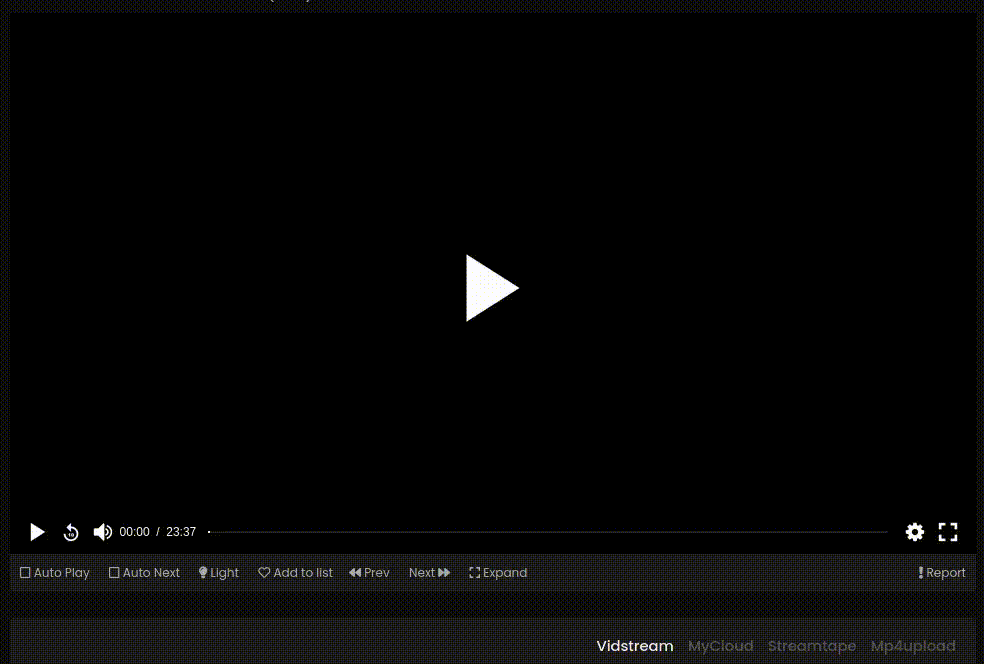

# Stream Bypass

A multi-browser addon / extension for multiple streaming providers which redirects directly to the source video.

This addon replaces the video player from this sides with the native player build-in into the browser or redirects directly to the source video.
This has the advantage, that no advertising or popups are shown when trying to interact with the video (playing, skipping, ...) or some sites are showing them even if you do nothing.
Additionally this enables you to download the video by right-clicking it and just choose the download option.

Supported streaming providers (for a complete list of all supported websites, see [here](SUPPORTED)):
- [streamtape.com](https://streamtape.com/)
- [vidoza.net](https://vidoza.net/)

<details id="example">
    <summary><b>How it's working</b></summary>
    
</details>

The addon was tested on
- Firefox (92.0)
- Chromium (92.0)
- Opera (78.0)

## Installing

### Firefox

Install the `.xpi` (firefox addon) file from the [latest release](https://github.com/ByteDream/vivosx-source-redirector/releases/latest).

### Chromium / Google Chrome

1. Download the `stream-bypass-<version>.zip` file from the [latest release](https://github.com/ByteDream/vivosx-source-redirector/releases/latest) and unzip it (with [7zip](https://www.7-zip.org/) or something like that).
2. Go into your browser and type `chrome://extensions` in the address bar.
3. Turn the developer mode in the top right corner on.
4. Click Load unpacked.
5. Choose the cloned / unzipped directory.

### Opera

1. Download the `stream-bypass-<version>.zip` file from the [latest release](https://github.com/ByteDream/vivosx-source-redirector/releases/latest) and unzip it (with [7zip](https://www.7-zip.org/) or something like that).
2. Go into your browser and type `opera://extensions` in the address bar.
3. Turn the developer mode in the top right corner on.
4. Click Load unpacked.
5. Choose the cloned / unzipped directory.

## Compiling

If you want to use / install the addon from source, you have to compile the `typescript` and `sass` files yourself.
- Compile it [manual](#manual).
- Compile it using [docker](#docker).

### Manual

For compiling everything bare bones, you need [typescript](https://www.typescriptlang.org/) and [sass](https://sass-lang.com/) installed.
- Compile typescript
  ```
  $ tsc -p src
  ```
- Compile sass (replace `<path to sass file>` with every `.sass` file in the `src` directory)
  ```
  $ sass --no-source-map <path to sass file>
  ```
The compiled output will be in the `src` directory.

If you want to keep it a little cleaner, you additionally need [python3](https://www.python.org).
- Compile everything with one line
  ```
  $ python3 build.py -b -c
  ```
The compiled output will remain in a (new created if not existing) `build` directory.

### Docker

For this, you need [docker](https://www.docker.com/) to be installed.
- Build the docker image
  ```
  $ docker build -t stream-bypass .
  ```
- Compile
  ```
  $ docker rum --rm -v build:/build stream-bypass
  ```
The compiled output will remain in a (new created if not existing) `build` directory.

##### Install

If you want to use the addon in Chromium or any browser which is based on it (almost every other, Google Chrome, Opera, ...), follow the steps in [installing](#installing).
When using firefox, use the following
1. Type `about:debugging` in the browser's address bar.
2. Select 'This Firefox' tab (maybe named different, depending on your language).
3. Under `Temporary Extensions`, click `Load Temporary Add-on`.
4. Choose any file in the directory where the compiled sources are.

## License

This project is licensed under the MIT License - see the [LICENSE](LICENSE) file for more details.
